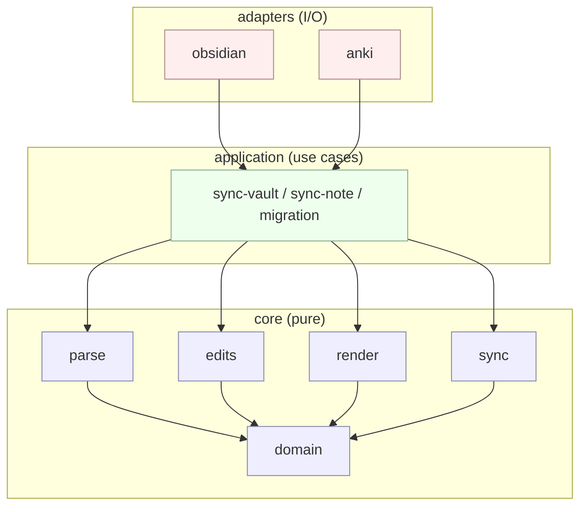
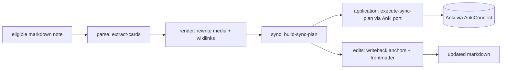

# Architecture Overview (v2)

Two views of the same code: **layers** (static structure) and **pipeline** (runtime flow).

The layer rules below are mechanically enforced by `npm run arch:check`
(see `.dependency-cruiser.cjs`). Runtime diagrams describe calls and data flow;
application I/O calls use ports implemented by adapters.

## Layers

**Rule**: `core` knows nothing about `application` or `adapters`.
`application` knows nothing about concrete `adapters`. Adapters implement
application ports and connect the use cases to Obsidian and Anki.

## v2 sync pipeline

Inputs: a note's markdown + frontmatter, plus prior sync state.
Outputs: (a) Anki mutations, (b) writebacks to the note (anchors, card
frontmatter, hashes).

## Sync scope

`src/core/config/sync-scope.ts` owns pure path matching and structured exclusion
reasons. Settings, notices, menus, and status indicators share those decisions.
Empty included folders means the whole vault; exact note exclusions and parent
folder exclusions override includes. The closest excluded ancestor explains an
inherited exclusion. Matching uses complete path segments.

The checks at different layers serve different purposes:

| Location | Responsibility |
| --- | --- |
| Obsidian commands | Reject excluded current notes before migration or Anki startup; capture the selected note across asynchronous dialogs. |
| Obsidian Markdown repository | Filter paths before full-note reads or incremental descriptor enumeration; provide scoped migration inputs. |
| Incremental vault scan | Keep excluded notes out of cached Anki verification, cue evidence, and saved cache entries. Scope settings participate in the cache key. |
| Application `syncNote` / `syncVault` / backfill | Guard direct callers before identity writes, batch preflight, parsing, or migration writes. Callers providing note bodies have already performed their reads. |
| Plugin status refresh | Show an excluded state without reading the active note; count pending migration only in eligible notes. |

Filtering a note is not a deletion instruction. Its existing Anki cards and
frontmatter identities remain. Resolving links or media referenced by eligible
notes is independent of whether the referenced path can itself sync.

The scope settings editor is shared between the settings tab and a supported
Obsidian modal. Note context menus update the same settings. Rename events
rewrite explicit path rules; settings writes are serialized, and scope mutation
controls are guarded while sync is active. Missing paths remain visible for
manual correction. Frontmatter overrides and wildcard matching are not part of
the scope model.

Regression coverage lives in `tests/core/config/sync-scope.test.ts`,
`tests/application/sync-scope.test.ts`, and the Obsidian adapter suites. Native
host checks are documented in `test-vault/scenarios/sync-scope/README.md`.
